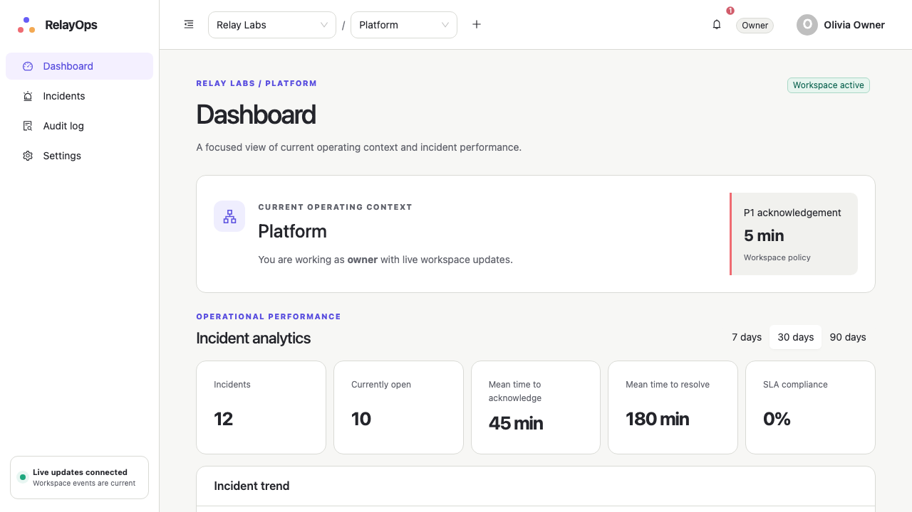
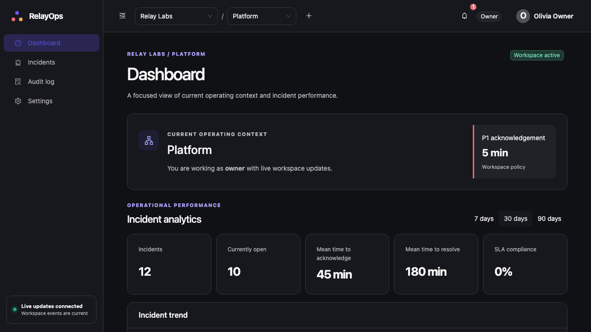
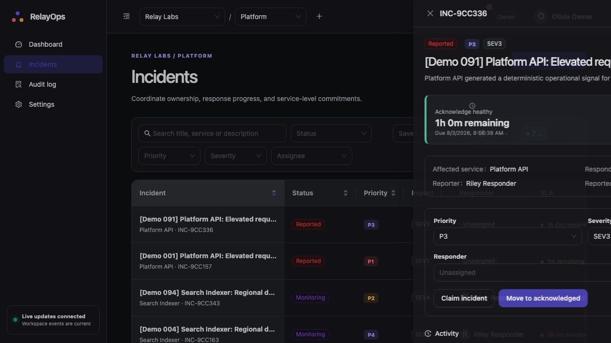
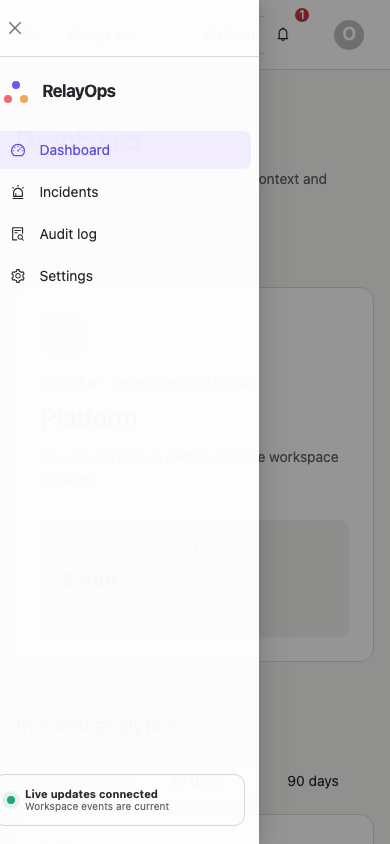
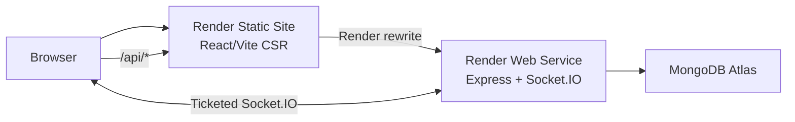

# RelayOps

[](https://github.com/khalteck/RelayOps/actions/workflows/ci.yml)

A multi-tenant incident-management and service-operations platform for distributed product teams.

> Stage 3 local production-readiness work is complete. The Render services remain intentionally
> undeployed until the explicit deployment review gate is approved.

## 1. Product overview

RelayOps gives product teams one operating context for reporting incidents, assigning responders,
protecting SLA deadlines, collaborating through an immutable timeline, and reviewing operational
performance. It is intentionally a focused, finished workflow rather than a collection of
unconnected screens.

## 2. The real-world problem

Distributed response teams often reconstruct ownership, deadlines, and decisions from several
tools while an incident is active. RelayOps makes tenant context, permissions, responsibility,
service commitments, and the incident record explicit in one workflow.

## 3. Screenshots and demonstration video

| Dashboard (light)                                                        | Dashboard (dark)                                                       |
| ------------------------------------------------------------------------ | ---------------------------------------------------------------------- |
|  |  |

| Incident timeline                                                        | Mobile navigation                                                            |
| ------------------------------------------------------------------------ | ---------------------------------------------------------------------------- |
|  |  |

Additional captures: [analytics](docs/assets/screenshots/analytics.png),
[audit log](docs/assets/screenshots/audit-log.png), and
[settings/user management](docs/assets/screenshots/settings.png). `pnpm e2e:demo` records the
walkthrough; CI retains the video, trace, screenshots, and HTML report as Playwright artifacts
instead of committing a large video.

## 4. Live demonstration link

Pending the explicit Render deployment approval. The reserved hosts are
`relayops-frontend.onrender.com` and `relayops-backend-sim7.onrender.com`.

## 5. Test credentials

The isolated demo seed uses `RelayOpsDemo!2026` and creates:

- `owner@relayops.demo`
- `admin@relayops.demo`
- `responder@relayops.demo`
- `viewer@relayops.demo`

These credentials are demo-only. They are never used for production or personal accounts.

## 6. Core features

- Secure cookie authentication, refresh rotation, CSRF protection, and safe logout recovery.
- Organisation/workspace switching and backend-enforced owner, administrator, responder, and
  viewer roles.
- Incident assignment, claiming, classification, strict transitions, SLA status, comments, and a
  chronological timeline.
- URL-driven filters, sorting, pagination, debounced search, private saved views, reusable CSV
  export, and URL-addressable drawers.
- Dashboard analytics with drill-down, account-targeted notifications, audit details, realtime
  workspace events, responsive navigation, and light/dark/system themes.
- Loading, empty, failure, keyboard, focus-restoration, and reduced-motion behavior.

No AI functionality is included in v1.

## 7. Architecture overview



See the complete [architecture guide](docs/architecture.md),
[database schema](docs/database-schema.md), and [accessibility review](docs/accessibility.md).

Decision records:

- [ADR-001: monorepo](docs/decisions/ADR-001-monorepo.md)
- [ADR-002: server and client state ownership](docs/decisions/ADR-002-state-ownership.md)
- [ADR-003: frontend and backend permission enforcement](docs/decisions/ADR-003-permission-enforcement.md)

## 8. Technology decisions

The pnpm monorepo keeps contracts and UI primitives versioned with both applications without adding
another task orchestrator. Shared Zod contracts validate transport inputs while Mongoose documents
remain backend-private. Route-level lazy imports separate authentication, shell, dashboard,
incident, settings, and audit code. Ant Design supplies robust primitives; the project token and CSS
layers provide product identity, responsive composition, and verified theme contrast.

## 9. Repository structure

```text
apps/frontend       React, Vite, React Router, TanStack Query, Zustand
apps/backend        Express, Mongoose, Socket.IO, domain modules
packages/ui         Shared visual primitives and accessible data table
packages/types      Zod contracts, DTOs, enums, permissions, realtime events
packages/config     Strict shared TypeScript configuration
e2e                 Playwright roles, workflows, screenshots, and harness
docs                Architecture, accessibility, schema, ADRs, and media
.github/workflows   CI quality, coverage, build, and browser jobs
render.yaml         Both Render services and routing
```

Frontend modules expose one `index.ts`; module-owned UI, queries/mutations, and lazy pages live in
`components`, `operations`, and `views`. See the repository diagrams in the
[architecture guide](docs/architecture.md).

## 10. Authentication and authorization model

Access tokens live for 15 minutes. Rotating refresh sessions live for seven days and are stored
hashed; replay revokes the session family. Tokens use host-only, production-secure, HTTP-only,
`SameSite=Lax` cookies. Mutations require an origin-checked CSRF header. The frontend hides
unavailable actions, while every backend operation reloads membership and authorizes an explicit
tenant context.

Logout revokes the refresh session and clears every auth cookie. An unusable session is treated as
already logged out. Recoverable network/server failures keep the confirmation open and show only a
generic retry message; operational error details never reach the account UI.

## 11. Data-fetching and state-management strategy

TanStack Query owns all remote data, request lifecycle, cache snapshots, optimistic rollback, and
realtime reconciliation. Zustand owns only persisted theme and desktop-sidebar preferences. Active
tenant, incident drawer, filters, sorting, pagination, and saved-view application live in the URL;
React Hook Form owns transient forms. This avoids duplicating server truth in a client store and is
defended in [ADR-002](docs/decisions/ADR-002-state-ownership.md).

## 12. Testing approach

- Vitest: contracts, permissions, workflow rules, SLA boundaries, state normalization, cache
  rollback, safe logout, semantic contrast, and shared components.
- MongoMemoryReplSet + Supertest: real transaction-capable authentication, tenant isolation,
  validation, incident/timeline/audit persistence, and cookie behavior without Atlas.
- React Testing Library + MSW + jest-axe: component behavior, request outcomes, and accessibility.
- Playwright + axe: Chromium workflows and media; Firefox/WebKit authentication, navigation,
  responsiveness, overflow, keyboard, and accessibility smoke checks.

Coverage gates are enforced on the production security, business-rule, shared-contract, and
client-state surfaces tracked by unit tests: backend/contracts 80% lines/functions/statements and
75% branches; frontend 70% lines/functions/statements and 65% branches. Integration and E2E cover
the transport and composed application boundaries separately.

Verified commands:

```bash
pnpm format:check
pnpm lint
pnpm typecheck
pnpm test
pnpm test:coverage
pnpm test:integration
pnpm build
pnpm build:analyze
pnpm validate:render
pnpm e2e
pnpm e2e:smoke
pnpm e2e:demo
pnpm verify
```

## 13. Local setup

1. Install Node 24 and enable Corepack.
2. Run `pnpm install --frozen-lockfile` from the repository root.
3. Copy `apps/backend/.env.example` to `apps/backend/.env` and configure it.
4. Copy `apps/frontend/.env.example` to `apps/frontend/.env` if overriding frontend defaults.
5. Run `pnpm seed`, then `pnpm dev`.
6. Open `http://localhost:5175`; the API runs on `http://localhost:4000`.

Backend development and seed scripts explicitly load `apps/backend/.env`. From inside a workspace,
run root commands with `pnpm -w`, such as `pnpm -w seed`.

## 14. Environment variables

| Variable                 | Service           | Purpose                               |
| ------------------------ | ----------------- | ------------------------------------- |
| `MONGODB_URI`            | Backend           | Atlas/local replica-set connection    |
| `WEB_ORIGIN`             | Backend           | Allowed frontend and Socket.IO origin |
| `ACCESS_TOKEN_SECRET`    | Backend           | Access-token signing                  |
| `REFRESH_TOKEN_SECRET`   | Backend           | Refresh-token signing                 |
| `REALTIME_TICKET_SECRET` | Backend           | 60-second Socket.IO ticket signing    |
| `AUTH_RATE_LIMIT`        | Backend           | 15-minute auth limit (default 20)     |
| `EMAIL_PROVIDER`         | Backend           | `memory` locally/CI or `resend`       |
| `EMAIL_FROM`             | Backend           | Verified transactional sender         |
| `RESEND_API_KEY`         | Backend           | Resend sending credential             |
| `RESEND_WEBHOOK_SECRET`  | Backend           | Delivery webhook verification         |
| `EMAIL_PAYLOAD_SECRET`   | Backend           | Encrypted outbox payload key          |
| `DEMO_PASSWORD`          | Backend           | Explicit demo-seed password           |
| `LOG_LEVEL`              | Backend           | Structured log threshold              |
| `VITE_SOCKET_URL`        | Frontend          | Direct Render backend URL             |
| `VITE_API_PROXY_TARGET`  | Frontend test/dev | Vite API proxy override               |

Never commit `.env` files, Atlas credentials, browser storage state, or generated test secrets.

## 15. Known trade-offs

V1 uses one assignee, private saved views, live aggregation, and a text affected-service field.
Transactional account email uses Resend for owner verification, invitations, and membership
lifecycle notices. Sensitive outbox payloads are encrypted and delivery webhooks are signed. The tracked coverage gates
focus on critical production logic rather than claiming full line coverage for route composition.
Account recovery, tenant deletion, attachments, integrations, shared saved views, notifications
outside the app, and a formal service catalogue are intentionally deferred.

## 16. Planned improvements

After deployment approval: configure Render/Atlas secrets, run the one-time idempotent seed, verify
the public `/api` rewrite, cookies, CSRF, Socket.IO, SPA deep links, health checks, and CI-gated
deployments, then replace the pending link above with verified live URLs. The exact handoff is in
[the production deployment gate](docs/deployment.md). Attachments, integrations, and a service catalogue remain post-v1 candidates. AI summarization is
considered only after the core platform and public deployment are separately approved and stable.
