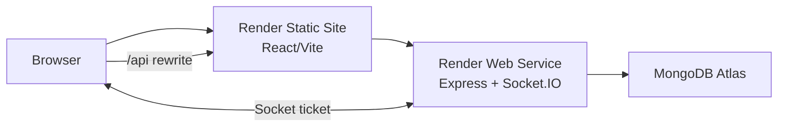

# RelayOps

A multi-tenant incident-management and service-operations platform for distributed product teams.

> Current milestone: Stage 1 foundation is implemented. Incident workflows and reporting remain
> behind the explicit Stage 2 review gate.

## 1. Product overview

RelayOps gives product teams a shared operating context for reporting incidents, assigning
responders, protecting SLA deadlines, collaborating through a timeline, and understanding
operational performance.

## 2. The real-world problem

Distributed response teams often reconstruct ownership, deadlines, and decisions from several
tools while an incident is active. RelayOps makes tenant context, permissions, responsibility, and
service commitments explicit in one workflow.

## 3. Screenshots or demo video

Stage 3 will add Playwright-captured light, dark, mobile, incident, and analytics screenshots plus a
recorded demonstration artifact.

## 4. Live demonstration link

Added after the Stage 3 Render deployment.

## 5. Test credentials

Run `pnpm seed` with `DEMO_PASSWORD` to create owner, administrator, responder, and viewer accounts
under the `@relayops.demo` domain. Public credentials are added only to the isolated demo deployment.

## 6. Core features

Stage 1 includes secure cookie authentication, protected routes, organisation/workspace switching,
RBAC, tenant administration, SLA policies, responsive navigation, and light/dark/system themes.
Incident workflows, realtime collaboration, saved views, analytics, and audit UI are Stage 2.

## 7. Architecture overview



See [architecture](docs/architecture.md) and the [database schema](docs/database-schema.md).

## 8. Technology decisions

The project uses a pnpm monorepo without an additional task orchestrator. Zod contracts cross the
transport boundary, while Mongoose models remain API-private. Ant Design supplies accessible
primitives; Tailwind and a small CSS layer handle responsive composition and product identity.

## 9. Repository structure

```text
apps/web        React/Vite client
apps/api        Express/Mongoose/Socket.IO service
packages/ui     Shared visual primitives and tokens
packages/types  Shared contracts, enums, and permissions
packages/config Shared tooling foundations
docs            Architecture, schema, and decision records
```

## 10. Authentication and authorization model

Access tokens live for 15 minutes; rotating refresh sessions live for 7 days and are stored hashed.
Both use secure HTTP-only cookies. Mutations require a double-submit CSRF token. Frontend
capabilities improve UX, while backend membership checks provide the security boundary.

## 11. Data-fetching and state-management strategy

TanStack Query owns all remote data. Zustand stores only theme and sidebar preference. Active tenant
and future list state live in the URL; form state stays in React Hook Form. See
[ADR-002](docs/decisions/ADR-002-state-ownership.md).

## 12. Testing approach

Vitest covers contracts, workflow policy, API health behavior, and UI components. Later stages add
MongoDB integration suites, React Testing Library interaction coverage, Playwright role and
realtime flows, axe checks, and deployment smoke tests.

## 13. Local setup

1. Use Node 24 and enable Corepack.
2. Run `pnpm install`.
3. Copy both application `.env.example` files to `.env`.
4. Point `MONGODB_URI` at an Atlas database or MongoDB replica set.
5. Run `pnpm dev`.
6. Open `http://localhost:5173`.

Useful checks: `pnpm format:check`, `pnpm lint`, `pnpm typecheck`, `pnpm test`, and `pnpm build`.

## 14. Environment variables

| Variable                 | Service | Purpose                               |
| ------------------------ | ------- | ------------------------------------- |
| `MONGODB_URI`            | API     | MongoDB Atlas connection              |
| `WEB_ORIGIN`             | API     | Allowed frontend and Socket.IO origin |
| `ACCESS_TOKEN_SECRET`    | API     | Access-token signing                  |
| `REFRESH_TOKEN_SECRET`   | API     | Refresh-token signing                 |
| `REALTIME_TICKET_SECRET` | API     | Short-lived Socket.IO ticket signing  |
| `DEMO_PASSWORD`          | API     | Explicit demo-seed password           |
| `VITE_SOCKET_URL`        | Web     | Direct Render Web Service URL         |

## 15. Known trade-offs

V1 uses one assignee, private saved views, live analytics aggregation, and a text affected-service
field. Invitations, account recovery, tenant deletion, attachments, notifications, integrations,
and a service catalogue are intentionally deferred.

## 16. Planned improvements

Stage 2 adds the complete incident lifecycle, saved views, optimistic updates, realtime cache
reconciliation, analytics, and audit screens. Stage 3 adds CI, full test coverage, accessibility and
performance review, demo data, media, and Render deployment. AI summarization is considered only
after those stages are complete.
