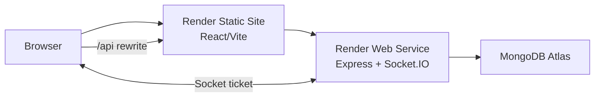

# RelayOps

A multi-tenant incident-management and service-operations platform for distributed product teams.

> Current milestone: Stage 2 product workflows are implemented and ready for the explicit review
> gate. Stage 3 professional finish and deployment have not started.

## 1. Product overview

RelayOps gives product teams a shared operating context for reporting incidents, assigning
responders, protecting SLA deadlines, collaborating through a timeline, and understanding
operational performance.

## 2. The real-world problem

Distributed response teams often reconstruct ownership, deadlines, and decisions from several
tools while an incident is active. RelayOps makes tenant context, permissions, responsibility, and
service commitments explicit in one workflow.

## 3. Screenshots or demo video

Stage 3 will add Playwright-captured light, dark, mobile, incident, and analytics screenshots plus a
recorded demonstration artifact.

## 4. Live demonstration link

Added after the Stage 3 Render deployment.

## 5. Test credentials

Run `pnpm seed` with `DEMO_PASSWORD` to create owner, administrator, responder, and viewer accounts
under the `@relayops.demo` domain. Public credentials are added only to the isolated demo deployment.

## 6. Core features

RelayOps includes secure cookie authentication, tenant switching, backend-enforced RBAC, incident
creation and assignment, strict status transitions, priority/severity classification, SLA
countdowns, immutable comments and timelines, URL-driven filtering, private saved views, realtime
collaboration, analytics drill-down, audit reporting, responsive drawers, and accessible themes.
The Stage 2 review build also includes owner-managed invitation links, account-targeted
notifications, audit detail inspection, and reusable bounded CSV exports.

## 7. Architecture overview



See [architecture](docs/architecture.md) and the [database schema](docs/database-schema.md).

## 8. Technology decisions

The project uses a pnpm monorepo without an additional task orchestrator. Zod contracts cross the
transport boundary, while Mongoose models remain API-private. Ant Design supplies accessible
primitives; Tailwind and a small CSS layer handle responsive composition and product identity.

## 9. Repository structure

```text
apps/web        React/Vite client
apps/api        Express/Mongoose/Socket.IO service
packages/ui     Shared visual primitives and tokens
packages/types  Shared contracts, enums, and permissions
packages/config Shared tooling foundations
docs            Architecture, schema, and decision records
```

## 10. Authentication and authorization model

Access tokens live for 15 minutes; rotating refresh sessions live for 7 days and are stored hashed.
Both use secure HTTP-only cookies. Mutations require a double-submit CSRF token. Frontend
capabilities improve UX, while backend membership checks provide the security boundary.

## 11. Data-fetching and state-management strategy

TanStack Query owns all remote data, optimistic snapshots, rollback, and realtime reconciliation.
Zustand stores only theme and sidebar preference. Active tenant, incident drawer, filters, sorting,
pagination, and visible columns live in the URL; form state stays in React Hook Form. See
[ADR-002](docs/decisions/ADR-002-state-ownership.md).

## 12. Testing approach

Vitest covers contracts, workflow policy, incident permissions, SLA boundaries, URL normalization,
optimistic rollback, API health behavior, semantic theme contrast, and UI components. Stage 3 adds
the full MongoDB integration matrix, broader React Testing Library coverage, Playwright role and
realtime flows, axe checks, and deployment smoke tests.

## 13. Local setup

1. Use Node 24 and enable Corepack.
2. Run `pnpm install` from the repository root.
3. Copy `apps/api/.env.example` to `apps/api/.env`.
4. Copy `apps/web/.env.example` to `apps/web/.env`.
5. Point `MONGODB_URI` at an Atlas database or MongoDB replica set.
6. Run `pnpm dev` from the repository root.
7. Open `http://localhost:5175`.

The API development and seed scripts load `apps/api/.env` explicitly. When running a root script
from inside a workspace such as `apps/web`, use the workspace-root flag: `pnpm -w seed` or
`pnpm -w dev`.

Useful checks: `pnpm format:check`, `pnpm lint`, `pnpm typecheck`, `pnpm test`, and `pnpm build`.

Review locally

Configure `apps/api/.env`, then run:

`pnpm seed`
`pnpm dev`

Seeded accounts:

owner@relayops.demo
admin@relayops.demo
responder@relayops.demo
viewer@relayops.demo

They use the configured DEMO_PASSWORD.

## 14. Environment variables

| Variable                 | Service | Purpose                               |
| ------------------------ | ------- | ------------------------------------- |
| `MONGODB_URI`            | API     | MongoDB Atlas connection              |
| `WEB_ORIGIN`             | API     | Allowed frontend and Socket.IO origin |
| `ACCESS_TOKEN_SECRET`    | API     | Access-token signing                  |
| `REFRESH_TOKEN_SECRET`   | API     | Refresh-token signing                 |
| `REALTIME_TICKET_SECRET` | API     | Short-lived Socket.IO ticket signing  |
| `DEMO_PASSWORD`          | API     | Explicit demo-seed password           |
| `VITE_SOCKET_URL`        | Web     | Direct Render Web Service URL         |

## 15. Known trade-offs

V1 uses one assignee, private saved views, live analytics aggregation, and a text affected-service
field. Invitation links are shared manually because outbound email delivery is deferred. Account
recovery, tenant deletion, attachments, external notifications, integrations, and a service
catalogue are also intentionally deferred.

## 16. Planned improvements

Stage 3 adds CI, comprehensive integration/E2E coverage, accessibility and performance review,
expanded demo history, media, and Render deployment. Email-delivered invitations, attachments,
external notification channels, and service catalogues remain possible post-v1 improvements. AI
summarization is considered only after the professional-finish stage is separately approved and
complete.
