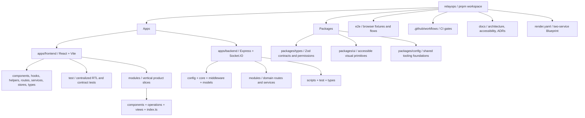
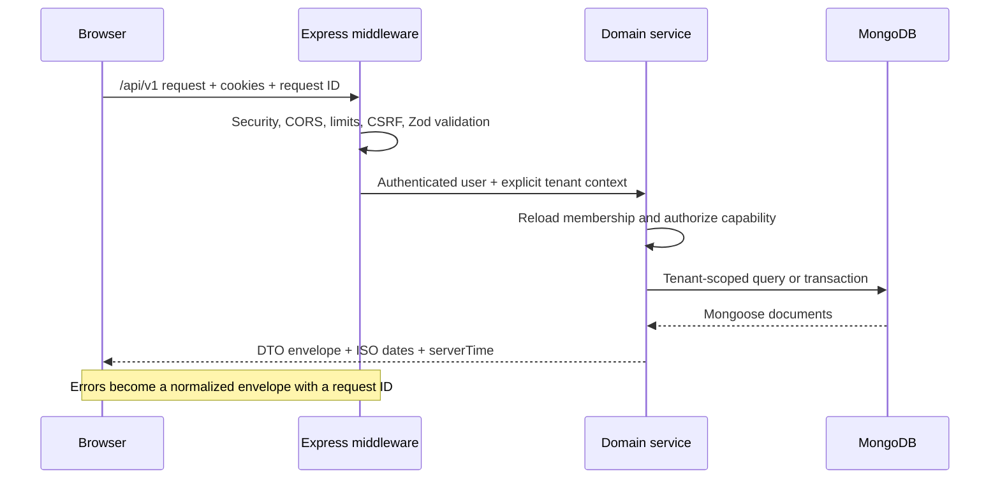
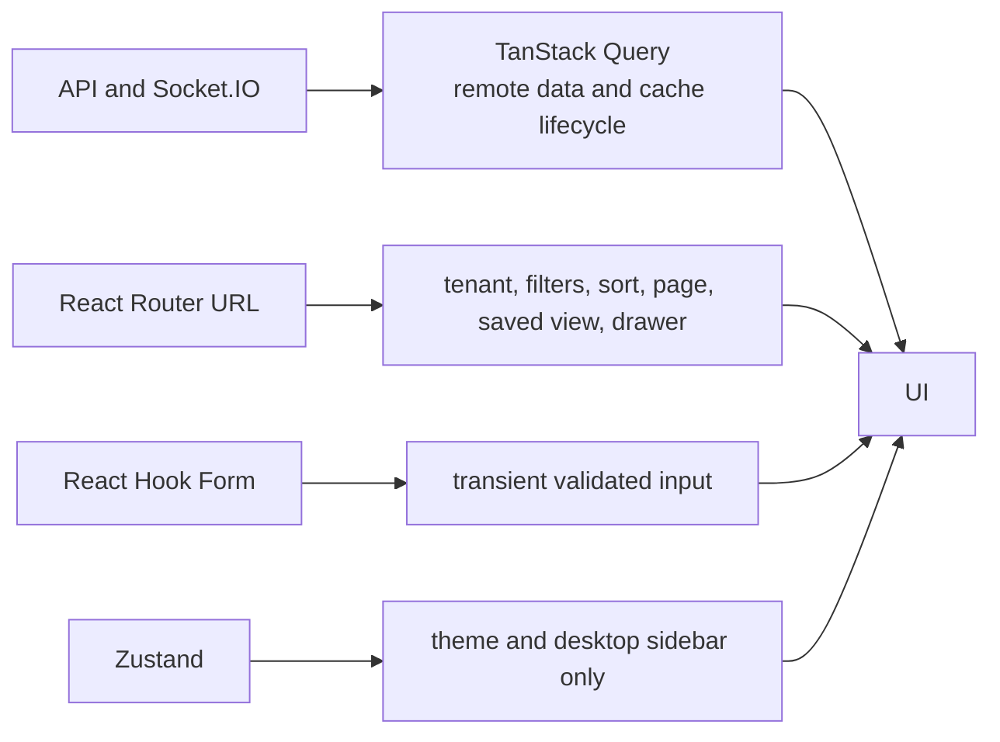
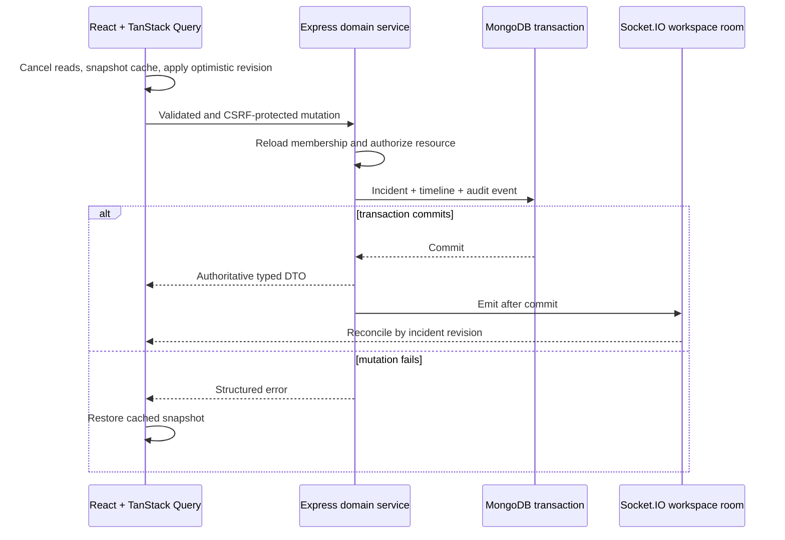
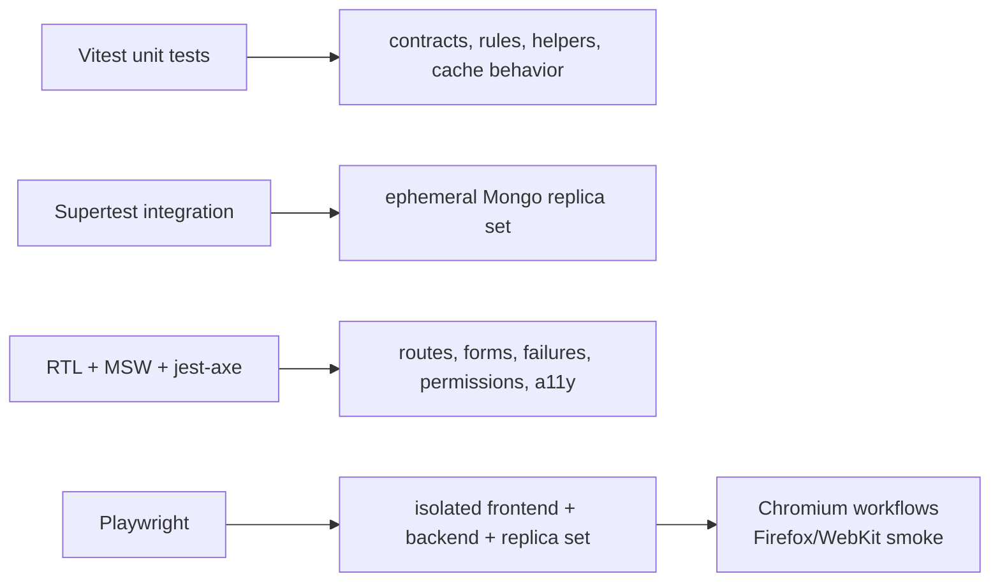
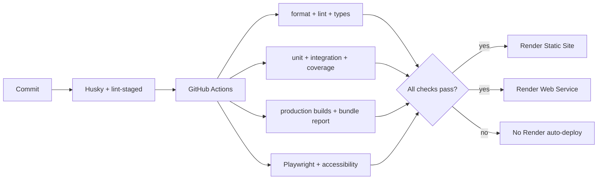

# RelayOps architecture

RelayOps is a client-rendered TypeScript application whose frontend and backend deploy independently
from one pnpm workspace. Shared packages define the transport and design boundaries without coupling
the applications' runtime state.

## Repository structure



Frontend module `index.ts` files are the supported cross-module interface. Route loaders dynamically
import `views`, module UI stays in `components`, and every TanStack Query definition lives in
`operations`. Shared-layer imports use the `@/` alias; imports within a module remain relative.

The backend retains domain-oriented modules behind common authentication, CSRF, validation,
request-context, rate-limit, error, and database infrastructure.

## Deployment topology


HTTP requests stay same-origin through the static-site rewrite. Socket.IO connects directly to the
backend after the cookie-authenticated browser exchanges its session for a short-lived ticket.
Authentication cookies never need to be exposed to the cross-origin socket connection.

## HTTP request flow



Mongoose documents never cross the transport boundary. Repository and service functions require
explicit tenant identifiers so workspace access cannot be inferred from client input alone.

## Authentication, refresh, and logout

```mermaid
sequenceDiagram
    participant UI as React UI
    participant Query as TanStack Query
    participant API as Auth API
    participant Sessions as Refresh sessions
    UI->>API: POST /logout + HttpOnly cookies + CSRF header
    API->>API: Authenticate access token and validate CSRF
    API->>Sessions: Revoke current hashed refresh session
    API-->>UI: Clear access, refresh, and CSRF cookies; 204
    UI->>Query: Clear authenticated server cache
    UI->>UI: Navigate to /login and disconnect workspace socket
    alt Access and refresh are already unusable
        API-->>UI: 401
        UI->>Query: Treat as signed out and clear server cache
    else Network or server failure
        UI->>UI: Keep modal open and show a generic retry message
        Note over UI: Never display backend auth details
    end
```

Access cookies last 15 minutes. Refresh sessions last seven days, are stored as hashes, rotate on
use, and revoke on replay detection. Logout revokes only the current browser session; other devices
remain signed in. Theme and sidebar preferences survive because Zustand contains no authenticated
server data.

## State ownership



The server remains authoritative for sessions, tenants, incidents, timelines, analytics, saved
views, notifications, and audit events. Query keys include workspace scope and normalized filters.

## Incident mutation and realtime reconciliation



Clients discard duplicate or older revisions and invalidate only affected list, detail, timeline,
analytics, audit, or notification keys. Notifications use a separate `user:{id}` room and never
inherit workspace-room visibility.

## Testing boundaries



Automated tests never use Atlas. The memory-backed replica set supports the same MongoDB
transactions used by incident mutations.

## CI and delivery flow



Both services use `autoDeployTrigger: checksPass`. Render build filters rebuild only the affected
application unless a shared package, root manifest, workspace file, or lockfile changes.

## Deliberate trade-offs

- One assignee keeps the operational model focused.
- Live aggregation avoids premature background analytics infrastructure.
- Invitations are manually shared; outbound email remains outside v1.
- The demo seed is deterministic and isolated from normal tenant creation.
- AI summarization remains deferred until the non-AI platform is deployed and reviewed.
