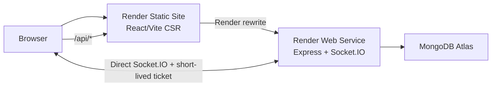

# RelayOps architecture

RelayOps is a client-rendered TypeScript application with independently deployable web and API
services in a single pnpm workspace.

## Runtime boundaries

- `apps/web` renders routes, owns interaction state, and consumes shared API contracts.
- `apps/api` owns authentication, authorization, validation, persistence, and realtime rooms.
- `packages/types` contains transport-safe Zod schemas and capability names. Mongoose models remain
  private to the API.
- `packages/ui` centralises design tokens and cross-feature visual primitives.

HTTP calls use the same-origin `/api` path through Render's Static Site rewrite. Socket.IO connects
to the API host directly. The frontend first exchanges its cookie-authenticated HTTP session for a
60-second realtime ticket, so authentication cookies never need cross-site access.

## Request flow

1. Request middleware creates or propagates a request ID.
2. Security, CORS, JSON size, cookie, and rate-limit middleware run before routes.
3. Shared Zod contracts validate request data.
4. Authentication resolves the user from a short-lived access cookie.
5. Tenant services reload membership and enforce capabilities at the resource boundary.
6. Domain services map Mongoose data into transport DTOs.
7. Errors return one structured envelope containing the request ID.

## State ownership

TanStack Query owns remote data and cache lifecycle. URL parameters own active tenant and list
state. React Hook Form owns transient form state. Zustand is intentionally limited to theme and
sidebar preference.

## Stage boundaries

Stage 1 contains the platform foundation, authentication, tenant switching, RBAC, schemas, SLA
settings, and application shell. Incident workflows, realtime cache updates, reporting, and audit
screens are intentionally reserved for Stage 2.
