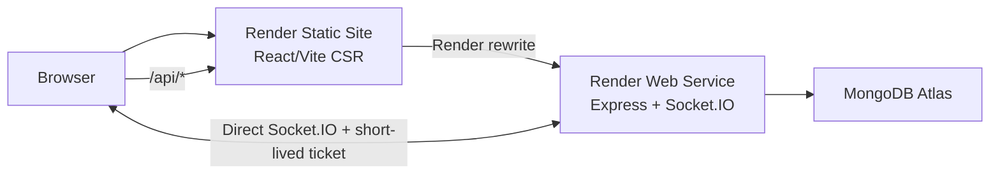
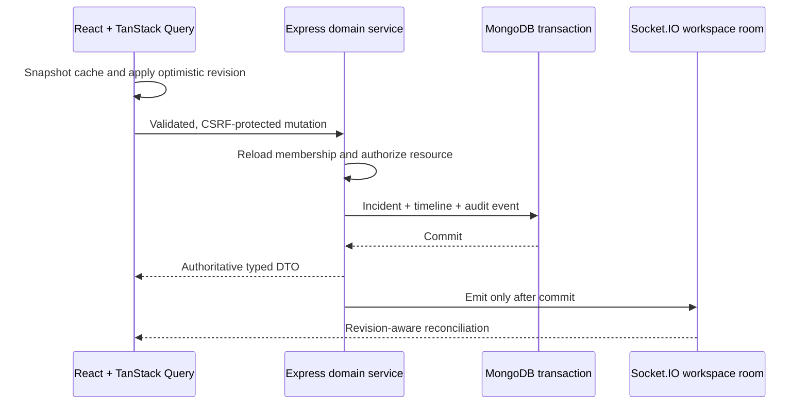

# RelayOps architecture

RelayOps is a client-rendered TypeScript application with independently deployable web and API
services in a single pnpm workspace.

## Runtime boundaries

- `apps/web` renders routes, owns interaction state, and consumes shared API contracts.
- `apps/api` owns authentication, authorization, validation, persistence, and realtime rooms.
- `packages/types` contains transport-safe Zod schemas and capability names. Mongoose models remain
  private to the API.
- `packages/ui` centralises design tokens and cross-feature visual primitives.

HTTP calls use the same-origin `/api` path through Render's Static Site rewrite. Socket.IO connects
to the API host directly. The frontend first exchanges its cookie-authenticated HTTP session for a
60-second realtime ticket, so authentication cookies never need cross-site access.

## Request flow

1. Request middleware creates or propagates a request ID.
2. Security, CORS, JSON size, cookie, and rate-limit middleware run before routes.
3. Shared Zod contracts validate request data.
4. Authentication resolves the user from a short-lived access cookie.
5. Tenant services reload membership and enforce capabilities at the resource boundary.
6. Domain services map Mongoose data into transport DTOs.
7. Errors return one structured envelope containing the request ID.

## State ownership

TanStack Query owns remote data and cache lifecycle. URL parameters own active tenant and list
state. React Hook Form owns transient form state. Zustand is intentionally limited to theme and
sidebar preference.

Central query keys include workspace scope and normalized filter input. Incident assignment,
transition, classification, and comment mutations cancel relevant reads, snapshot list/detail or
timeline caches, apply a local revision, and restore the snapshot on error. The committed API DTO
replaces the optimistic value on success.

## Incident mutation and realtime flow

Realtime clients discard incident revisions they have already processed, refresh their 60-second
connection ticket after an expired reconnect, and target only the incident list, detail, timeline,
analytics, or audit cache affected by an event.

Notifications use a separate `user:{id}` Socket.IO room and are always queried with the
authenticated user ID. Workspace rooms never broaden notification visibility. Owner-created
invitations store only a hash of the seven-day acceptance token; v1 returns the link once for manual
sharing and intentionally defers outbound email infrastructure.

## Stage boundaries

Stage 1 contains the platform foundation, authentication, tenant switching, RBAC, schemas, SLA
settings, and application shell. Stage 2 adds incident workflows, private saved views, optimistic
updates, realtime reconciliation, the combined dashboard, analytics, audit reporting, bounded CSV
exports, invitation-based user management, and account notifications. Stage 3 remains responsible
for the comprehensive test matrix, accessibility/performance review, CI, media, and Render
deployment.
