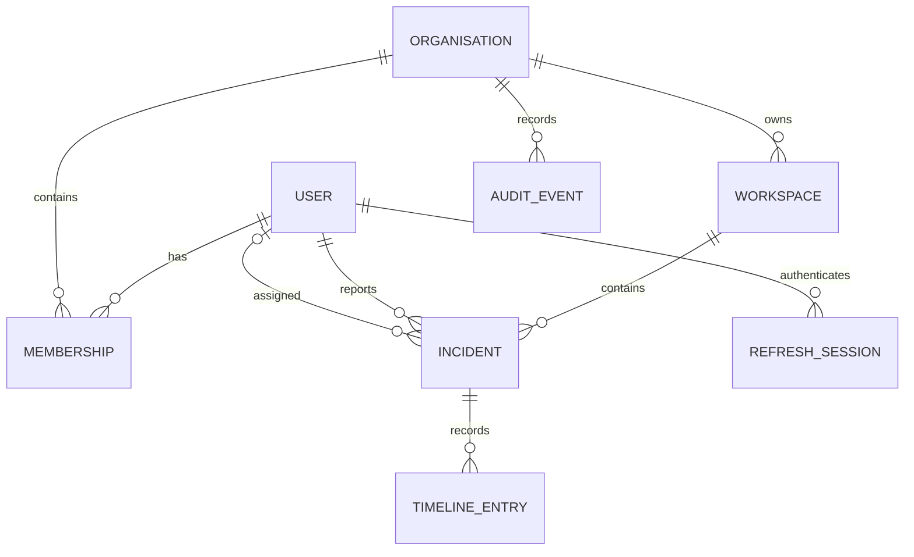

# Database schema

Every operational record carries an organisation and/or workspace boundary. Repository functions
must receive tenant context rather than accepting an unscoped identifier.

## Collections

- `users`: normalized unique email, display name, selected password hash.
- `refreshsessions`: hashed rotating token, expiry, revocation, and request fingerprint.
- `organisations`: immutable unique slug and editable display name.
- `memberships`: unique user/organisation pair, organisation role, allowed workspace IDs.
- `workspaces`: organisation scope, immutable per-organisation slug, editable SLA policy.
- `incidents`: tenant scope, classification, assignment, SLA snapshot, and monotonic revision.
- `timelineentries`: immutable, cursor-sortable incident collaboration history.
- `auditevents`: immutable organisation-scoped mutation record with request correlation.

Incident list indexes begin with workspace scope. Timeline and audit indexes end with descending
creation time. Text search covers incident title, description, and affected service.
